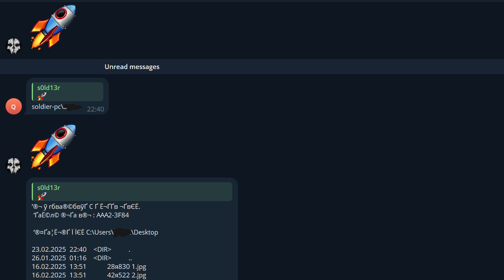
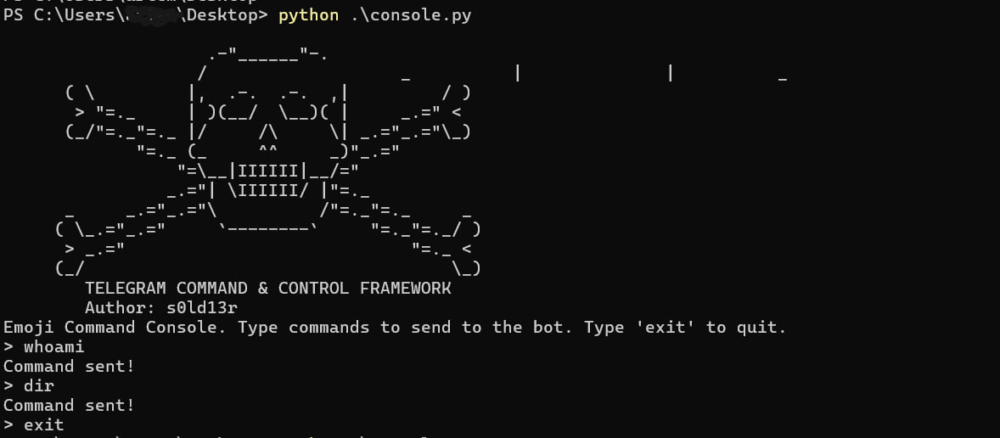

# GhostShell


GhostShell is a stealthy command execution tool that leverages Telegram and emoji encoding to send commands to a remote agent while maintaining a low profile. The agent decodes the commands and executes them on the target machine, sending responses back to the operator.

## Features
- 🔥 **Stealth Mode** – Uses emoji encoding for obfuscation.
- 🎭 **Telegram-based Communication** – No direct network exposure.
- 📸 **Screenshots & Webcam Capture** – Retrieve visual data remotely.
- 📁 **File Management** – View, download, and upload files.
- 💻 **System Commands Execution** – Run shell commands remotely.

## Installation
1. Clone the repository:
   ```sh
   git clone https://github.com/your-repo/GhostShell.git
   cd GhostShell
   ```
2. Install dependencies:
   ```sh
   pip install -r requirements.txt
   ```
3. Configure your API credentials in `console.py`:
   ```python
   API_ID = "your_api_id"
   API_HASH = "your_api_hash"
   CHAT_ID = your_chat_id
   ```
4. Run the agent on the target machine:
   ```sh
   python agent.py
   ```
5. Start the command console:
   ```sh
   python console.py
   ```

## Usage
1. Launch the console:
   ```sh
   python console.py
   ```
2. Enter your commands (e.g., `whoami`, `screenshot`, `downloadFile <path>`).
3. The response will be received in your terminal.
4. Type `exit` to quit.

## Examples



Encoded command send from Telegram account to C2 agent.



Usage of console.py to send commands to Bot.

## Disclaimer
This tool is intended for educational and security research purposes only. Unauthorized use is strictly prohibited. The developers are not responsible for any misuse of this software.

---
GhostShell 🕶️👻 - Stay in the shadows!